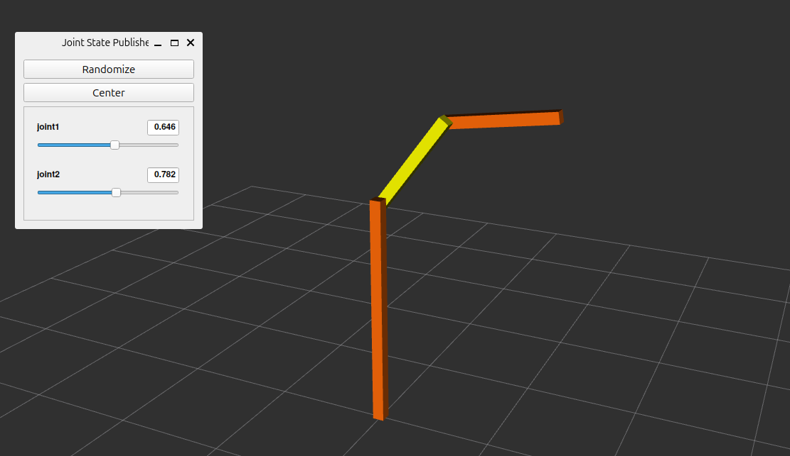

# Conceptos básicos de ros2_control

En este apartado se va aplicar ros2_control para mover las articulaciones de un robot de 2 grados de libertad. El paquete ros2_control_sca contiene la descripción del robot utilizando [Xacro](http://wiki.ros.org/xacro). En este apartado se incorporará la información necesaria a la descripción para que pueda ser controlador mediante ros2_control.

En primer lugar se compilarán los paquetes descargados en  ros2_ws, para ello se utilizará el comando colcon (si no se ha hecho ya anteriormente):
```
cd ~/ros2_ws/ && colcon build
```
Además, después de compilar, se debe utilizar el comando source sobre el espacio de trabajo para asegurarse de que los paquetes recién añadidos sean detectados por ROS2:
```
source install/setup.bash
```
Ejecuta el siguiente comando para ver en rviz el modelo simulado del robot que se va a controlar:

```
ros2 launch ros2_robot_sca view_robot.launch.py
```


El modelo de robot que se ha incorporado al mundo simulado no implementa nada de ros2_control. A continuación, se describirán los pasos a seguir para implementar ros2_control desde cero. Para ello se partirá de la descripción del robot en un archivo Xacro. Para agregar ros2_control a nuestro robot, se seguirán los siguientes pasos:

* Crear un nuevo paquete.
* Crear un archivo de configuración para el controller manager y los algoritmos de control.
* Actualizar el archivo Xacro de la descripción del robot.
* Crear un archivo de lanzamiento (launch) que inicie los controladores.
* Probar el robot controlado por ros2_control.

## Crear un nuevo paquete

Cuando se trabaja con ROS, generalmente se recomienda dividir un proyecto robótico en paquetes separados, ya que esto permite un diseño modular y minimiza las dependencias entre paquetes. Por lo tanto, comencemos creando un nuevo paquete dedicado exclusivamente a almacenar la configuración y los archivos de lanzamiento de ros2_control. Para ello, seguir los pasos que se indican a continuación.

Ir al directorio src dentro de ros2_ws:
```
cd ~/ros2_ws/src
```
Crear un nuevo paquete llamado my_robot_bringup ejecutando lo siguiente:
```
ros2 pkg create --build-type=ament_cmake my_robot_bringup --dependencies urdf xacro robot_state_publisher
```
Esto producirá la siguiente salida:


## Crear un archivo de configuración para el controller manager y los algoritmos de control

Dentro del paquete recién creado, se van a agregar los archivos de configuración para ros2_control y los controladores que se utilizarán. El archivo de configuración estará dentro de la carpeta config, así que se agregará esa carpeta a nuestro paquete:
```
cd ~/ros2_ws/src/my_robot_bringup
```

```
mkdir config
```

En la carpeta config crear un archivo llamado controller_configuration.yaml:
```
touch ~/ros2_ws/src/my_robot_bringup/config/controller_configuration.yaml

```
Añadirle el siguiente contenido:
```
# Controller manager configuration
controller_manager:
  ros__parameters:
    update_rate: 10  # Hz

    ### Controllers available
    joint_state_broadcaster:
      type: joint_state_broadcaster/JointStateBroadcaster

    forward_position_controller:
      type: forward_command_controller/ForwardCommandController

    joint_trajectory_controller:
      type: joint_trajectory_controller/JointTrajectoryController


### Properties of the controllers that we will use and definition of joints to use ###
forward_position_controller:
  ros__parameters:
    joints:
      - joint1
    interface_name: position


joint_trajectory_controller:
  ros__parameters:
    joints:
      - joint1

    command_interfaces:
      - position

    state_interfaces:
      - position

    state_publish_rate: 200.0 # Hz, Defaults to 50
    action_monitor_rate: 20.0 # Hz, Defaults to 20

    allow_partial_joints_goal: false # Defaults to false
    open_loop_control: true
    allow_integration_in_goal_trajectories: true
    constraints:
      stopped_velocity_tolerance: 0.01 # Defaults to 0.01
      goal_time: 0.0 # Defaults to 0.0 (start immediately)
```

A continuación, se describirá este código por partes:

```
# Controller manager configuration
controller_manager:
  ros__parameters:
    update_rate: 10  # Hz
```

Los archivos de configuración de ros2_control son simplemente archivos de parámetros típicos para ROS2. Como tal, la primera línea debe especificar el nombre del nodo de ROS2 (controller_manager) y la segunda línea debe ser ros__parameters: con una indentación. Luego, en otro nivel de indentación, configuramos el controller manager estableciendo la frecuencia del bucle de control a 10 Hz. La frecuencia del bucle  de control es uno de los parámetros que se puede ajustar para obtener el comportamiento esperado en nuestros actuadores.

```
    ### Controllers available
    joint_state_broadcaster:
      type: joint_state_broadcaster/JointStateBroadcaster

    forward_position_controller:
      type: forward_command_controller/ForwardCommandController

    joint_trajectory_controller:
      type: joint_trajectory_controller/JointTrajectoryController
```

Después, al mismo nivel de indentación, definimos los controladores que queremos tener disponibles. Para definir un controlador, debemos proporcionar un nombre único (que podemos elegir libremente) seguido de dos puntos, y en la siguiente línea ingresamos un tipo de controlador, de la misma manera que en este nuevo ejemplo mostrado aquí:

```
    joint1_position_controller:
      type: effort_controllers/JointGroupEffortController
```

El tipo de controlador, se refiere al nombre del plugin ros2_control que se utilizará. Se puede hacer referencia al nombre de los plugins de controladores comunes proporcionados por el paquete ros2_controllers, los cuales se han descrito anteriormente. También es posible crear un plugin de controlador personalizado y asignarle un nombre a tu elección como se describirá más adelante. El resto del archivo de configuración es el siguiente:

```
### Properties of the controllers that we will use and definition of joints to use ###
forward_position_controller:
  ros__parameters:
    joints:
      - joint1
    interface_name: position


joint_trajectory_controller:
  ros__parameters:
    joints:
      - joint1

    command_interfaces:
      - position

    state_interfaces:
      - position

    state_publish_rate: 200.0 # Hz, Defaults to 50
    action_monitor_rate: 20.0 # Hz, Defaults to 20

    allow_partial_joints_goal: false # Defaults to false
    open_loop_control: true
    allow_integration_in_goal_trajectories: true
    constraints:
      stopped_velocity_tolerance: 0.01 # Defaults to 0.01
      goal_time: 0.0 # Defaults to 0.0 (start immediately)
```

Finalmente, al nivel de indentación raíz, debemos incluir los parámetros requeridos por los controladores que queremos tener disponibles. En el código de arriba, hay dos controladores cuyas propiedades están siendo definidas. Recuerda que nombramos esos controladores: forward_position_controller y joint_trajectory_controller.

Las propiedades específicas y valores de parámetros que se definen para cada controlador se explicaron anteriormente. Uno de los parámetros de configuración más importantes que se debe definir es el nombre de las articulaciones que serán controladas por cada controlador, que son estas dos líneas aquí:

```
    joints:
      - joint1
```

Importante: los nombres de las articulaciones que se definen en este archivo de configuración deben coincidir con los nombres de las articulaciones en el archivo URDF/Xacro. El archivo yaml de arriba, por ejemplo, asigna una articulación con el nombre "joint1" a ambos controladores. "joint1" corresponde al nombre de la articulación definido por la etiqueta XML <joint name="joint1" type="revolute"> dentro del archivo .xacro (rrbot_description.urdf.xacro en la carpeta ros2_ws/src/ros2_robot_sca/description/rrbot/urdf).

## Actualizar el archivo Xacro de la descripción del robot

Para habilitar ros2_control, también debemos agregar algunos nuevos elementos XML al archivo URDF o Xacro que describa el robot. En esta sección, se describe cómo modificar un archivo de descripción de robot existente.

Para ello, en primer lugar se describirá la estructura de los ficheros xacro que definen el robot. El fichero xacro principal es rrbot.urdf.xacro que se encuentra en ros2_robot_sca/description/urdf. El contenido de este fichero es:
```
<?xml version="1.0"?>
<!-- Revolute-Revolute Manipulator -->
<!--
Copied and modified from ROS1 example -
https://github.com/ros-simulation/gazebo_ros_demos/blob/kinetic-devel/rrbot_description/urdf/rrbot.xacro
-->
<robot xmlns:xacro="http://www.ros.org/wiki/xacro" name="2dof_robot">
  <xacro:arg name="prefix" default="" />
  <xacro:arg name="use_gazebo" default="false" />

  <!-- Import RRBot macro -->
  <xacro:include filename="$(find ros2_robot_sca)/rrbot/urdf/rrbot_description.urdf.xacro" />

  <!-- Import Rviz colors -->
  <xacro:include filename="$(find ros2_robot_sca)/rrbot/urdf/rrbot.materials.xacro" />

  <!-- Used for fixing robot -->
  <link name="world"/>

  <xacro:rrbot parent="world" prefix="$(arg prefix)">
    <origin xyz="0 0 0" rpy="0 0 0" />
  </xacro:rrbot>

</robot>
```

Se observa que se importan una serie de macros que definirán las características del robot:

* ```<xacro:include filename="$(find ros2_robot_sca)/rrbot/urdf/rrbot_description.urdf.xacro" />```. Aquí se definen las articulaciones y dimensiones del robot (inercia, características geométricas, etc).
* ```<xacro:include filename="$(find ros2_robot_sca)/rrbot/urdf/rrbot.materials.xacro" />```. Aquí se definen los materiales y colores de los eslabones.

A continuación definir una nueva macro que incluirá los tags de ros2_control necesarios para controlar las articulaciones. Para ello, añadir el siguiente código justo debajo de las 2 líneas anteriores:
```
<!-- Import RRBot ros2_control description -->
  <xacro:include filename="$(find ros2_robot_sca)/ros2_control/rrbot.ros2_control.xacro" />
```
Además, en la carpeta ros2_control del paquete ros2_robot_sca/description/ros2_control/ se deberá crear el fichero rrbot.ros2_control.xacro:
```
touch ~/ros2_ws/src/ros2_robot_sca/description/ros2_control/rrbot.ros2_control.xacro
```
Incluir el siguiente código en el archivo anterior:
```
<?xml version="1.0"?>
<robot xmlns:xacro="http://www.ros.org/wiki/xacro">

  <xacro:macro name="rrbot_ros2_control" params="name prefix use_gazebo:=^|false">

    <ros2_control name="${name}" type="system">
      <hardware>
        <xacro:if value="${use_gazebo}">
          <plugin>gz_ros2_control/GazeboSimSystem</plugin>
        </xacro:if>
        <xacro:unless value="${use_gazebo}">
          <plugin>ros2_robot_sca/RRBotSystemPositionOnlyHardware</plugin>
          <param name="example_param_hw_start_duration_sec">0</param>
          <param name="example_param_hw_stop_duration_sec">3.0</param>
          <param name="example_param_hw_slowdown">100</param>
        </xacro:unless>
      </hardware>

      <joint name="${prefix}joint1">
        <command_interface name="position">
          <param name="min">-1</param>
          <param name="max">1</param>
        </command_interface>
        <state_interface name="position"/>
      </joint>
      <joint name="${prefix}joint2">
        <command_interface name="position">
          <param name="min">-1</param>
          <param name="max">1</param>
        </command_interface>
        <state_interface name="position"/>
      </joint>
    </ros2_control>

  </xacro:macro>

</robot>
```

Este fichero incorpora los siguientes tags:
```
<ros2_control name="${name}" type="system">
```
El framework ros2_control utiliza la etiqueta ```<ros2_control>``` en el archivo URDF del robot para describir sus componentes y sus funciones.
```
<xacro:if value="${use_gazebo}">
    <plugin>gz_ros2_control/GazeboSimSystem</plugin>
</xacro:if>           
```
El elemento <hardware> es necesario para definir la interfaz de hardware de ros2_control, que conectará los controladores con los actuadores. En este ejemplo, se utiliza gz_ros2_control/GazeboSimSystem como interfaz de hardware porque se quiere utilizar ros2_control para nuestro robot simulado en Gazebo. En los siguientes apartados, se describirá más detalles de las interfaces hardware. 

```
<joint name="${prefix}joint1">
    <command_interface name="position">
        <param name="min">-1</param>
        <param name="max">1</param>
    </command_interface>
    <state_interface name="position"/>
</joint>
```
Este bloque de etiquetas XML agrega un elemento ```<joint name=" ">``` como un elemento hijo de la etiqueta ```<ros2_control>```. El elemento ```<joint name=" ">``` se usa para definir qué interfaces de comando e interfaces de estado están habilitadas para cada articulación. Por ejemplo, aquí se define una única interfaz de comando que solo permite enviar órdenes de posición a las articulaciones. Pero también se podría optar por agregar una segunda interfaz de comando que permita controlar velocidades. Lo mismo aplica a las interfaces de estado. Usando la etiqueta ```<state_interface name="..."/>```, se define qué magnitudes del estado de la articulación (por ejemplo, posición, velocidad, esfuerzo, aceleración, etc.) estarán disponibles (transmitidas) por ros2_control para cada articulación.

Repitiendo la estructura mostrada anteriormente, se agrega tantos elementos ```<joint name=" ">``` como articulaciones reales tenga el robot. Luego, dentro de cada uno, se define tantas interfaces de comando e interfaces de estado como necesite nuestro controlador y como soporte el hardware del robot.

Por último, como queremos ejecutar una simulación en Gazebo, también se necesita iniciar un plugin para Gazebo. Añadir este código al final de rrbot.urdf.xacro pero antes de cerrar /robot>:
```
  <xacro:rrbot_ros2_control
    name="RRBot" prefix="$(arg prefix)" use_gazebo="$(arg use_gazebo)"/>

  <xacro:if value="$(arg use_gazebo)">
    <!-- Import Gazebo Classic definitions + plugin -->
    <xacro:include filename="$(find ros2_robot_sca)/gazebo/rrbot.gazebo.xacro" />
    <xacro:rrbot_gazebo prefix="$(arg prefix)"/>
  </xacro:if>
```

Ten en cuenta que estas etiquetas XML no son necesarias para ros2_control, sino para Gazebo. Este código carga el fichero rrbot.gazebo.xacro que se encuentra en ros2_ws/src/ros2_robot_sca/description/gazebo. Crear ese fichero mediante el comando:

```
touch ~/ros2_ws/src/ros2_robot_sca/description/gazebo/rrbot.gazebo.xacro
```
Incluir el siguiente código en el archivo anterior:

```
<?xml version="1.0"?>
<!--
Copied and modified from ROS1 example -
https://github.com/ros-simulation/gazebo_ros_demos/blob/kinetic-devel/rrbot_description/urdf/rrbot.gazebo
-->
<robot xmlns:xacro="http://ros.org/wiki/xacro">

  <xacro:macro name="rrbot_gazebo" params="prefix">

    <!-- ros_control plugin -->
    <gazebo>
      <plugin filename="gz_ros2_control-system" name="gz_ros2_control::GazeboSimROS2ControlPlugin">
        <parameters>$(find my_robot_bringup)/config/controller_configuration.yaml</parameters>
      </plugin>
    </gazebo>

    <!-- Link1 -->
    <gazebo reference="${prefix}base_link">
      <material>Gazebo/Orange</material>
    </gazebo>

    <!-- Link2 -->
    <gazebo reference="${prefix}link1">
      <mu1>0.2</mu1>
      <mu2>0.2</mu2>
      <material>Gazebo/Yellow</material>
    </gazebo>

    <!-- Link3 -->
    <gazebo reference="${prefix}link2">
      <mu1>0.2</mu1>
      <mu2>0.2</mu2>
      <material>Gazebo/Orange</material>
    </gazebo>

  </xacro:macro>

</robot>
```
Observa que dentro de la etiqueta ```<gazebo><plugin>```, tenemos un elemento ```<parameter>```, que se utiliza para cargar el archivo de configuración .yaml creado en la sección anterior. Por lo tanto, recuerda: cuando se ejecuta ros2_control con un robot simulado en Gazebo, se pasa el archivo de configuración .yaml del controlador aquí, dentro de las etiquetas del plugin de Gazebo.


## Crear un archivo de lanzamiento (launch) que inicie los controladores

Con el archivo de configuración listo y el archivo URDF actualizado, es momento de crear un archivo de lanzamiento para generar el nuevo robot y los controladores. Para ello, ejecutar los siguientes comandos:
```
cd ~/ros2_ws/src/my_robot_bringup
```

```
mkdir launch
```

Crea un nuevo archivo my_robot.launch.py dentro del directorio launch, siguiendo las instrucciones:
```
cd launch
```

```
touch my_robot.launch.py
```

```
chmod +x my_robot.launch.py
```

Introducir el siguiente Código en el fichero recién creado:
```  python
from launch import LaunchDescription
from launch.actions import DeclareLaunchArgument, IncludeLaunchDescription
from launch.conditions import IfCondition
from launch.launch_description_sources import PythonLaunchDescriptionSource
from launch.substitutions import Command, FindExecutable, PathJoinSubstitution, LaunchConfiguration
from launch_ros.actions import Node
from launch_ros.substitutions import FindPackageShare


def generate_launch_description():

    # Declare arguments
    declared_arguments = []
    declared_arguments.append(
        DeclareLaunchArgument(
            "gui",
            default_value="false",
            description="Start Gazebo automatically with this launch file.",
        )
    )

    # Initialize Arguments
    gui = LaunchConfiguration("gui")

    # gazebo
    gazebo = IncludeLaunchDescription(
        PythonLaunchDescriptionSource(
            [FindPackageShare("ros_gz_sim"), "/launch/gz_sim.launch.py"]
        ),
        launch_arguments={"gz_args": " -r -v 3 empty.sdf"}.items(),
    )

    gz_spawn_entity = Node(
        package="ros_gz_sim",
        executable="create",
        output="screen",
        arguments=[
            "-topic",
            "/robot_description",
            "-name",
            "rrbot_system_position",
            "-allow_renaming",
            "true",
        ],
    )

    # Get URDF via xacro
    robot_description_content = Command(
        [
            PathJoinSubstitution([FindExecutable(name="xacro")]),
            " ",
            PathJoinSubstitution(
                [FindPackageShare("ros2_robot_sca"), "urdf", "rrbot.urdf.xacro"]
            ),
            " ",
            "use_gazebo:=true",
        ]
    )
    robot_description = {"robot_description": robot_description_content}

    robot_controllers = PathJoinSubstitution(
        [
            FindPackageShare("my_robot_bringup"),
            "config",
            "controller_configuration.yaml",
        ]
    )

    rviz_config_file = PathJoinSubstitution(
        [FindPackageShare("ros2_robot_sca"), "rrbot/rviz", "rrbot.rviz"]
    )

    node_robot_state_publisher = Node(
        package="robot_state_publisher",
        executable="robot_state_publisher",
        output="screen",
        parameters=[robot_description],
    )

    joint_state_broadcaster_spawner = Node(
        package="controller_manager",
        executable="spawner",
        arguments=["joint_state_broadcaster"],
    )

    robot_controller_spawner = Node(
        package="controller_manager",
        executable="spawner",
        arguments=["forward_position_controller", "--param-file", robot_controllers],
    )

    nodes = [
        gazebo,
        node_robot_state_publisher,
        gz_spawn_entity,
        joint_state_broadcaster_spawner,
        robot_controller_spawner,
    ]

    return LaunchDescription(declared_arguments + nodes)
```

A continuación, se describirá el fichero launch por partes:

```  python
from launch import LaunchDescription
from launch.actions import DeclareLaunchArgument, IncludeLaunchDescription
from launch.conditions import IfCondition
from launch.launch_description_sources import PythonLaunchDescriptionSource
from launch.substitutions import Command, FindExecutable, PathJoinSubstitution, LaunchConfiguration
from launch_ros.actions import Node
from launch_ros.substitutions import FindPackageShare
```

Agregar estas declaraciones de importación nos permitirá utilizar las funciones definidas dentro de estos módulos.
```  python
def generate_launch_description():
```
Aquí definimos una función que retornará un objeto LaunchDescription.
```  python
gz_spawn_entity = Node(
    package="ros_gz_sim",
    executable="create",
    output="screen",
    arguments=[
        "-topic",
        "/robot_description",
        "-name",
        "rrbot_system_position",
        "-allow_renaming",
        "true",
    ],
)
```
Este código sirve para generar en Gazebo la versión actualizada del modelo del robot (que incluye los elementos de ros2_control).

```  python
robot_description_content = Command(
    [
        PathJoinSubstitution([FindExecutable(name="xacro")]),
        " ",
        PathJoinSubstitution(
            [FindPackageShare("ros2_robot_sca"), "urdf", "rrbot.urdf.xacro"]
        ),
         ",
        "use_gazebo:=true",
    ]
)
robot_description = {"robot_description": robot_description_content}
```
En ROS2, usamos el módulo xacro de Python con un código como el anterior para analizar archivos xacro directamente en el archivo de lanzamiento. Básicamente, esto carga el modelo del robot definido dentro del archivo xacro y lo almacena en la variable robot_description para su uso posterior.

```  python
node_robot_state_publisher = Node(
    package="robot_state_publisher",
    executable="robot_state_publisher",
    output="screen",
    parameters=[robot_description],
)
``` 
En este código se genera un nodo robot_state_publisher, proporcionando la variable robot_description como parámetro. Este nodo lee el topic /joint_states del joint_state_broadcaster y proporciona una realimentación continua de las ubicaciones de las articulaciones del robot a través de los topics tf y tf_static.
```  python
joint_state_broadcaster_spawner = Node(
    package="controller_manager",
    executable="spawner",
    arguments=["joint_state_broadcaster"],
)
``` 
Aquí se utiliza un script de Python llamado spawner, que es proporcionado por el paquete controller_manager, para cargar e iniciar el joint_state_broadcaster. 

El joint_state_broadcaster publica el estado del robot en los topics "/rrbot_controller/state" y "/joint_states". El estado del robot, descrito por la posición, velocidad y esfuerzo de cada articulación, se transmite como un mensaje "sensor_msgs/JointState" de ROS2, que puede ser leído por cualquier nodo de ROS2.
```  python
robot_controller_spawner = Node(
    package="controller_manager",
    executable="spawner",
    arguments=["forward_position_controller", "--param-file", robot_controllers],
)
```
Aquí se utiliza el mismo script que antes para cargar e iniciar un forward_position_controller (que se ha definido anteriormente en el fichero controller_configuration.yaml). Con este controlador cargado, se puede enviar comandos de posición a las articulaciones del robot.

A continuación, es necesario asegurarse que ROS reconoce el fichero launch que acabamos de crear. Para ello, abrir el fichero CMakeLists.txt (del paquete my_robot_bringup) y añadir un comando install(DIRECTORY...) al final del fichero:
```
install(
  DIRECTORY
    launch
    config
  DESTINATION
    share/${PROJECT_NAME}/
)
```
Esto le indica a colcon build que coloque una copia o un enlace tanto de la carpeta launch como del archivo de configuración YAML en el directorio share. Este directorio es el lugar predeterminado donde ROS2 buscará elementos como archivos de lanzamiento. Asegúrate de guardar todo y ejecuta colcon build:
```
cd ~/ros2_ws
```

```
colcon build
```

```
source install/setup.bash
```
## Probar el robot controlado por ros2_control
En este apartado se va a comprobar si todo funciona correctamente. Para ello, ejecutar el comando ros2 launch en un terminal:
```
ros2 launch my_robot_bringup my_robot.launch.py
```
Se mostrará un mensaje en la consola confirmando que tanto joint_state_broadcaster como forward_position_controller han sido cargados, configurados e iniciados.


Ahora deberías ver el modelo del robot aparecer en Gazebo:


A continuación, se va a comprobar los topics disponibles para enviar comandos. Para ello, abrir un nuevo terminal y ejecutar los siguientes comandos:
```
cd ~/ros2_ws
source install/setup.bash
ros2 topic list
```
Entre otros, deberías ver que el siguiente topic está disponible, que lo utilizaremos para enviar comandos al robot:
```
/forward_position_controllers/commands
```


Podemos usar este comando para publicar datos en el topic (se mueve la primera articulación a la posición 0.79 en radianes):
```
ros2 topic pub /forward_position_controller/commands std_msgs/msg/Float64MultiArray "data:
- 0.79" -1
```
Si todo ha ido bien deberías ver lo siguiente:


Con solo unos pocos pasos de configuración y sin necesidad de desarrollo, ahora podemos mover el robot publicando comandos en un topic. Nuestro robot ya puede interactuar con todo el ecosistema de ROS2.

## Ejercicio


!!! note annotate "Ejercicio"

    Para aplicar lo aprendido, en este ejercicio tendremos que indicarle a ros2_control que también queremos controlar la segunda articulación del robot, la que tiene el nombre joint2. Para eso, se deberán modificar los archivos en los que has trabajado hasta ahora y ampliarlos para agregar la segunda articulación, de modo que al final puedas mover ambas articulaciones en el robot simulado usando ros2_control.

    Una vez hecho esto, ejecutar el siguiente comando en una terminal:
    ```
    ros2 launch my_robot_bringup my_robot.launch.py
    ```
    En otra terminal ejecutar los siguientes comandos:
    ```
    ros2 topic pub /forward_position_controller/commands std_msgs/msg/Float64MultiArray "data:
    - 1.57
    - -1.57" -1
    ```
    ```
    ros2 topic pub /forward_position_controller/commands std_msgs/msg/Float64MultiArray "data:
    - -1.57
    - 0.79" -1
    ```
    Los comandos anteriores deberían colocar el robot en las siguientes posiciones:

    
    