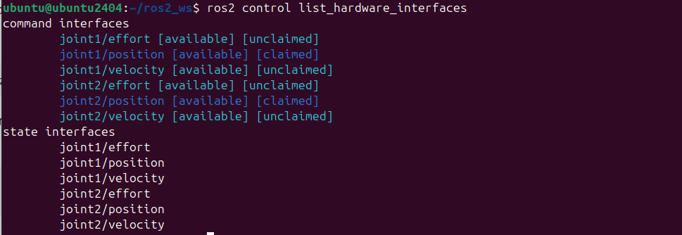
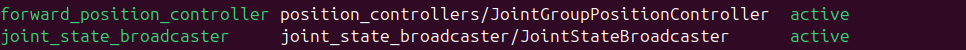
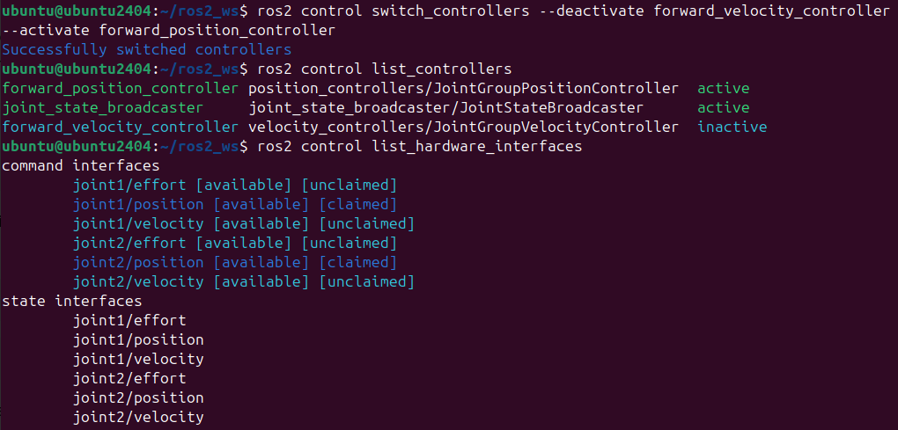

# Interfaz hardware

Después de que el controlador calcula la acción de control, su salida se envía a una interfaz hardware. Una interfaz hardware es un componente software que puede comunicarse con ROS2_control en un extremo y con uno o más dispositivos de hardware en el otro extremo.

Por ejemplo, supóngase que se tiene un sensor de posición que obtiene lecturas de datos de posición. Estas lecturas sin procesar son recibidas por la interfaz hardware y enviadas a un controlador que está escuchando esos datos. Cuando el controlador produce un nuevo comando, éste es recibido por la interfaz hardware. Luego, este comando se transforma en el formato de datos específico requerido y comprendido por el dispositivo hardware. Por lo tanto, se puede ver una interfaz hardware como un intermediario e intérprete que traduce los datos del hardware al controlador y viceversa.

En realidad, la interfaz hardware y ros2_control están acopladas mediante una interfaz de plugin. En términos técnicos, decimos que ros2_control implementa una "clase abstracta" y la interfaz hardware implementa la "clase derivada". De esta manera, el algoritmo de control no tiene que conocer los detalles específicos del hardware. Y como la interfaz de hardware es un plugin, no crea un nodo ROS2. En los siguientes apartados se irán viendo más detalles de todo esto y se aplicarán a nuestro robot de dos grados de libertad.


## Tipos de interfaz hardware

El framework ros2_control proporciona un conjunto de tipos de interfaces hardware que se pueden utilizar para implementar un componente de hardware para un robot o dispositivo específico. Las siguientes secciones describen los diferentes tipos de interfaces hardware y su uso.

El hardware en ros2_control se describe mediante un URDF. La definición se puede encontrar en el repositorio de [ros2_control](https://github.com/ros-controls/ros2_control/blob/master/hardware_interface/include/hardware_interface/hardware_info.hpp). Puedes consultar las estructuras definidas allí para ver qué atributos están disponibles para cada una de las etiquetas XML. A continuación se proporciona un ejemplo genérico que muestra la estructura (más abajo se describirá un nuevo ejemplo en la sección "ejemplo").


???+ example
    ```
    <ros2_control name="Name_of_the_hardware" type="system">
    <hardware>
        <plugin>library_name/ClassName</plugin>
        <!-- added to hardware_parameters -->
        <param name="example_param">value</param>
    </hardware>
    <joint name="name_of_the_component">
        <command_interface name="interface_name">
            <!-- All of them are optional. `data_type` and `size` are used for GPIOs. Size is length of an array. -->
            <param name="min">-1</param>
            <param name="max">1</param>
            <param name="initial_value">0.0</param>
            <param name="data_type"></param>
            <param name="size">5</param>
            <!-- Optional. Added to the key/value storage parameters -->
            <param name="own_param_1">some_value</param>
            <param name="own_param_2">other_value</param>
        </command_interface>
        <!-- Short form to define StateInterface. Can be extended like CommandInterface. -->
        <state_interface name="position"/>
    </joint>
    </ros2_control>
    ```


### Articulaciones
La etiqueta ```<joint>``` agrupa las interfaces asociadas con las articulaciones de los robots físicos y los actuadores. Tienen interfaces de comando (```<command_interface name="interface_name">```) y de estado (```<state_interface name="position"/>```) para establecer los valores objetivo para el hardware y leer su estado actual.

Todas las articulaciones definidas en la etiqueta ```<ros2_control>``` deben estar presentes en el URDF recibido por el controller manager. Las interfaces de estado de las articulaciones pueden ser publicadas como un topic de ROS mediante el joint_state_broadcaster.

### Sensores
La etiqueta ```<sensor>``` agrupa múltiples interfaces de estado que describen, por ejemplo, los estados internos del hardware. Dependiendo del tipo de sensor, existen algunos componentes semánticos específicos con emisores (broadcasters) proporcionados por ros2_controllers.

### GPIOs
La etiqueta ```<gpio>``` se utiliza para describir puertos de entrada y salida de un dispositivo robótico que no pueden asociarse con ninguna articulación o sensor. El análisis de la etiqueta ```<gpio>``` es similar al de la etiqueta ```<joint>```, teniendo interfaces de comando y de estado. La etiqueta debe tener al menos una etiqueta ```<command>``` o ```<state>``` como hija.

La palabra clave "gpio" se eligió por su generalidad. Aunque se usa estrictamente para señales digitales, describe cualquier señal eléctrica analógica, digital o valor físico. La etiqueta ```<gpio>``` puede usarse como hija de los tres tipos de componentes de hardware, es decir, sistema, sensor o actuador.

Debido a que los puertos implementados como ```<gpio>``` suelen ser muy específicos de la aplicación, no existe un emisor genérico dentro del marco ros2_control. Se debe implementar un controlador GPIO personalizado para cada aplicación. 

### Grupos de Hardware
Los grupos de componentes hardware sirven como un mecanismo organizacional crítico dentro de sistemas complejos, facilitando el manejo de errores y la tolerancia a fallos. Al agrupar componentes de hardware relacionados, como los actuadores dentro de un manipulador, los usuarios pueden establecer un marco unificado para la detección de errores y la respuesta.

Los grupos de componentes hardware juegan un papel vital en la propagación de errores a través de los componentes de hardware interconectados. Por ejemplo, en un sistema manipulador, agrupar los actuadores permite la propagación de errores. Si un actuador falla dentro del grupo, el error puede propagarse a los otros actuadores, señalando un posible problema en todo el sistema. De forma predeterminada, los errores de los actuadores se aíslan en su propio componente de hardware, lo que permite que el resto continúe funcionando sin verse afectado. En la configuración proporcionada de ros2_control, la etiqueta ```<group>``` dentro de cada bloque ```<ros2_control>``` significa el agrupamiento de componentes de hardware, habilitando los mecanismos de propagación de errores dentro del sistema.

### Ejemplo
El siguiente ejemplo muestra cómo usar los diferentes tipos de interfaces hardware en un URDF de ros2_control. Estos pueden combinarse dentro de los diferentes tipos de componentes hardware (sistema, actuador, sensor) de la siguiente manera:

Sistema RRBot con múltiples interfaces GPIO

* Digital: 4 entradas y 2 salidas
* Analógico: 2 entradas y 1 salida
* Válvula de vacío en la brida (encendido/apagado)*

???+ example
    ```
    <ros2_control name="RRBotSystemMutipleGPIOs" type="system">
        <hardware>
            <plugin>ros2_control_demo_hardware/RRBotSystemPositionOnlyHardware</plugin>
            <param name="example_param_hw_start_duration_sec">2.0</param>
            <param name="example_param_hw_stop_duration_sec">3.0</param>
            <param name="example_param_hw_slowdown">2.0</param>
        </hardware>
        <joint name="joint1">
            <command_interface name="position">
                <param name="min">-1</param>
                <param name="max">1</param>
            </command_interface>
            <state_interface name="position"/>
        </joint>
        <joint name="joint2">
            <command_interface name="position">
                <param name="min">-1</param>
                <param name="max">1</param>
            </command_interface>
            <state_interface name="position"/>
        </joint>
        <gpio name="flange_digital_IOs">
            <command_interface name="digital_output1"/>
            <state_interface name="digital_output1"/>    <!-- Needed to know current state of the output -->
            <command_interface name="digital_output2"/>
            <state_interface name="digital_output2"/>
            <state_interface name="digital_input1"/>
            <state_interface name="digital_input2"/>
        </gpio>
        <gpio name="flange_analog_IOs">
            <command_interface name="analog_output1"/>
            <state_interface name="analog_output1">    <!-- Needed to know current state of the output -->
                <param name="initial_value">3.1</param>  <!-- Optional initial value for mock_hardware -->
            </state_interface>
            <state_interface name="analog_input1"/>
            <state_interface name="analog_input2"/>
        </gpio>
        <gpio name="flange_vacuum">
            <command_interface name="vacuum"/>
            <state_interface name="vacuum"/>    <!-- Needed to know current state of the output -->
        </gpio>
    </ros2_control>
    ```
## Control en posición, velocidad y aceleración

Una vez descritos los principales aspectos teóricos de los interfaces hardware, en este apartado se va a modificar el interfaz hardware de nuestro robot de dos grados de libertad para permitir el control en posición, velocidad y esfuerzo (recuerda que hasta ahora sólo permitía enviarle comandos de posición). Para ello, modificar el fichero rrbot.ros2_control.xacro que se encuentra en ros2_robot_sca/description/ros2_control para incluir las interfaces de velocidad y aceleración. Por ejemplo, la definición para joint1 debería ser la siguiente:

 ```
     <joint name="joint1">
       <command_interface name="position">
         <param name="min">-1</param>
         <param name="max">1</param>
       </command_interface>
       <command_interface name="velocity">
         <param name="min">-1</param>
         <param name="max">1</param>
       </command_interface>
       <command_interface name="effort">
         <param name="min">-1</param>
         <param name="max">1</param>
       </command_interface>
       <state_interface name="position"/>
       <state_interface name="velocity"/>
       <state_interface name="effort"/>
     </joint>
 ```

 Se observa que se ha incluido las tres interfaces de comando (posición, velocidad y esfuerzo) para permitir que la articulación pueda ser accionada con comandos de posición, velocidad o esfuerzo. Además, se han incluido esas mismas interfaces de estado, lo que permitirá al controlador obtener una realimentación de las tres variables  y conocer su valor en cada momento. Repetir lo mismo para joint2. 
 
 A continuación modificar el fichero de configuración controller_configuration.yaml, que se encuentra en my_robot_bringup/config, para definir controladores de velocidad y esfuerzo. Para ello, editar el fichero controller_configuration.yaml y modificar la sección de controladores disponibles para que incluya los siguientes:

```
    joint_state_broadcaster:
      type: joint_state_broadcaster/JointStateBroadcaster

    forward_position_controller:
      type: position_controllers/JointGroupPositionController

    forward_velocity_controller:
      type: velocity_controllers/JointGroupVelocityController

    forward_effort_controller:
      type: effort_controllers/JointGroupEffortController
```

Se observa que se han definido tres controladores (adicionales al joint_state broadcaster). El controlador ```forward_position controller``` es un contrador de tipo ```position_controllers/JointGroupPositionController```, por lo tanto, genera una acción de control de posición (aceptará también consignas de posición). El controlador ```forward_velocity_controller``` es de tipo ```velocity_controllers/JointGroupVelocityController```. En este caso, genera una acción de control de velocidad (aceptando consignas de velocidad). Por último, el controlador ```forward_effort_controller``` es definido como ```effort_controllers/JointGroupEffortController```, por lo tanto, implementa un controlador que manda dirctamente un esfuerzo articular.


Además, incluir la siguiente información en el fichero controller_configuration.yaml en la parte de propiedades de los controladores (borrar previamente la información que contenía el fichero .yaml en este apartado):

```
forward_position_controller:
  ros__parameters:
    joints:
      - joint1
      - joint2
    interface_name: position

forward_velocity_controller:
  ros__parameters:
    joints:
      - joint1
      - joint2
    interface_name: velocity

forward_effort_controller:
  ros__parameters:
    joints:
      - joint1
      - joint2
    interface_name: effort
```
Con este código se está asignando los tres controladores definidos anteriormente a las interfaces correspondientes.

Por último, habría que modificar el fichero my_robot.launch.py para cargar el controlador correspondiente (forward_position_controller, forward_velocity_controller o forward_effort_controller) para las articulaciones. Recordar que en el fichero launch se cargaba el controlador ```forward_position_controller``` mediante este código:
```
    robot_controller_spawner = Node(
        package="controller_manager",
        executable="spawner",
        arguments=["forward_position_controller", "--param-file", robot_controllers],
    )
```
Se va a modificar para que pueda especificarse el controlador mediante un parámetro. Esto puede conseguirse siguiendo los siguientes pasos:

Primero, añadir la información del nuevo parámetro en la definición del fichero launch:

``` py
    declared_arguments.append(
        DeclareLaunchArgument(
            "robot_controller",
            default_value="forward_velocity_controller",
            description="Robot controller to start.",
        )
    )
```

En el apartado de inicialización de los argumentos incluir esta instrucción:
``` py
robot_controller = LaunchConfiguration("robot_controller")
```

La llamada al controlador correpondiente se obtendrá mediante la siguiente instrucción (eliminar previamente la instrucción original ```robot_controller_spawner = Node(...)```):
``` py
    robot_controller_spawner = Node(
        package="controller_manager",
        executable="spawner",
        arguments=[robot_controller, "--param-file", robot_controllers],
    )
```

Una vez hecho estos cambios, ejecutar los siguienes comandos y comprobar si todo está correcto:
```
cd ~/ros2_ws/ && colcon build
source install/setup.bash
```
se puede cargar el robot con el controlador correspondiente mediante:
```
ros2 launch my_robot_bringup my_robot.launch.py
```

Por defecto se ejecutará el velocity controller, puede cambiarse el controlador mediante la siguiente opción para el controlador de posición:
```
ros2 launch my_robot_bringup my_robot.launch.py robot_controller:=forward_position_controller
```
O para el controlador de esfuerzo:
```
ros2 launch my_robot_bringup my_robot.launch.py robot_controller:=forward_effort_controller
```
En otra terminal se pueden comprobar los interfaces disponibles mediante el siguiente comando:
```
ros2 control list_hardware_interfaces
```
Se obtendrá lo siguiente si has cargado un controlador de posición:



El marcador [claimed] de cada interfaz significa que un controlador tiene acceso al comando RRBot.

Verifica qué controladores están en ejecución mediante este comando:
```
ros2 control list_controllers
```
Si se ha cargado el controlador de posición se obtiene lo siguiente:



Verifica cómo cambia esta salida si usas los diferentes argumentos de lanzamiento descritos anteriormente.

A continuación puedes enviar comandos a los controladores para mover las articulaciones del robot. El comando cambiará dependiendo del controlador cargado:

* Cuando uses el controlador forward_position_controller:
```
ros2 topic pub /forward_position_controller/commands std_msgs/msg/Float64MultiArray "data:
- 0.5
- 0.5"
```
* Cuando uses el controlador forward_velocity_controller:
```
ros2 topic pub /forward_velocity_controller/commands std_msgs/msg/Float64MultiArray "data:
- 5
- 5"
```
* Cuando uses el controlador forward_effort_controller:
```
ros2 topic pub /forward_effort_controller/commands std_msgs/msg/Float64MultiArray "data:
- 10
- 10"
```

También puedes cambiar controladores durante la ejecución, lo que también cambia automáticamente el modo de comando. Para ello, vamos a suponer que estás utilizando un controlador tipo forward_velocity_controller. Recuerda que para eso puedes usar el siguiente comando:
```
ros2 launch my_robot_bringup my_robot.launch.py robot_controller:=forward_velocity_controller
```
Ahora vamos a cambiarlo por un controlador de posición (forward_position_controller). Para ello, utilizaremos los dos siguientes comandos:
```
ros2 control load_controller forward_position_controller $(ros2 pkg prefix my_robot_bringup --share)/config/controller_configuration.yaml
```
```
ros2 control set_controller_state forward_position_controller inactive
```

Ahora ya puedes cambiar controlador forward_velocity_controller por el forward_position_controller usando el siguiente comando:
```
ros2 control switch_controllers --deactivate forward_velocity_controller --activate forward_position_controller
```
Ahora ya puedes mandarle al robot comandos de posición. Comprobar los interfaces y controladores con los siguientes comandos:
```
ros2 control list_controllers
```
```
ros2 control list_hardware_interfaces
```


!!! note annotate "Ejercicio"

    Experimentar con los distintos controladores y comprobar la diferencia de comportamiento dependiendo del tipo de controlador/comando utilizado.

## Control PID

En este apartado se incluirá un nuevo tipo de controlador (PID) y se añadirán los cambios y parámetros necesarios para su funcionamiento. En primer lugar, se considerará un controlador PID con referencia posición y acción de control velocidad. Los cambios necesarios a añadir al fichero controller_configuration.yaml para el nuevo controlador (pid_position_velocity_controller) son los que se muestran a continuación.

Primero añadir el tipo de controlador:
```
    pid_position_velocity_controller:
      type: pid_controller/PidController
```
Y después incluir las características del controlador:
```
pid_position_velocity_controller:
  ros__parameters:
    dof_names:
      - joint1
      - joint2
    
    command_interface: velocity  # Acción de control será velocidad
    reference_interface: position  # Referencia será posición
    
    # Configuración de interfaces
    reference_and_state_interfaces: 
      - position
    
    # Ganancias PID para cada articulación
    gains:
      joint1:
        p: 10.0  # Ganancia proporcional
        i: 0.1   # Ganancia integral
        d: 0.01  # Ganancia derivativa
        i_clamp_max: 1.0
        i_clamp_min: -1.0
        antiwindup: true
      
      joint2:
        p: 10.0
        i: 0.1
        d: 0.01
        i_clamp_max: 1.0
        i_clamp_min: -1.0
        antiwindup: true
```
Tras añadir el controlador pid_position_velocity_controller al fichero controller_configuration.yaml, se deberá probar si, utilizando este nuevo controlador, se alcanzan distintas posiciones de referencia. Para ello, se debe poder cargar el controlador con esta instrucción:
```
ros2 launch my_robot_bringup my_robot.launch.py robot_controller:=pid_position_velocity_controller
```
Si se quiere, por ejemplo, que el robot alcance la posición articular (0.5 0.5) rad para ambas articulaciones se puede utilizar el siguiente comando:
```
ros2 topic pub /pid_position_velocity_controller/reference control_msgs/msg/MultiDOFCommand "{
    dof_names: ['joint1', 'joint2'], 
    values: [0.5, 0.5], 
    values_dot: [0.0, 0.0]
}"
```

!!! note annotate "Ejercicio"

    Tratar de ajustar correctamente las constantes del controlador PID para que el robot se posicione sin oscilaciones (probar que se alcance bien para distintas posiciones de referencia).


Para hacer el ajuste de las constantes proporcional, derivativa e integral, si ya tienes cargado el controlador PID, puedes cambiar estas constantes mediante comandos como los siguientes (desde otra terminal):

* Cambiar la ganancia P de joint1:
```
ros2 param set /pid_position_velocity_controller gains.joint1.p 15.0
```
* Cambiar la ganancia I de joint2:
```
ros2 param set /pid_position_velocity_controller gains.joint2.i 0.2
```

Por último, una forma de evaluar si el robot se está posicionando correctamente, es obtener una gráfica de la evolución de las articulaciones en los distintos experimentos. 

<!--
 Para ello, se puede utilizar ROS 2 + rqt_plot:
 ```
 ros2 run rqt_plot rqt_plot /joint_states/position[0] rqt_plot /joint_states/position[0]
 ```
Desde qt_plot se pueden introducir topics adicionales a plotear desde el cuadro de texto Topics.
-->


!!! note annotate "Ejercicio"

    Diseñar un nuevo controlador con referencia posición y acción de control esfuerzo. Ajustarlo y probar que se alcancen bien distintas posiciones de referencia. Para ello, diseñar un script que permita representar la evolución de la posición de las articulaciones.