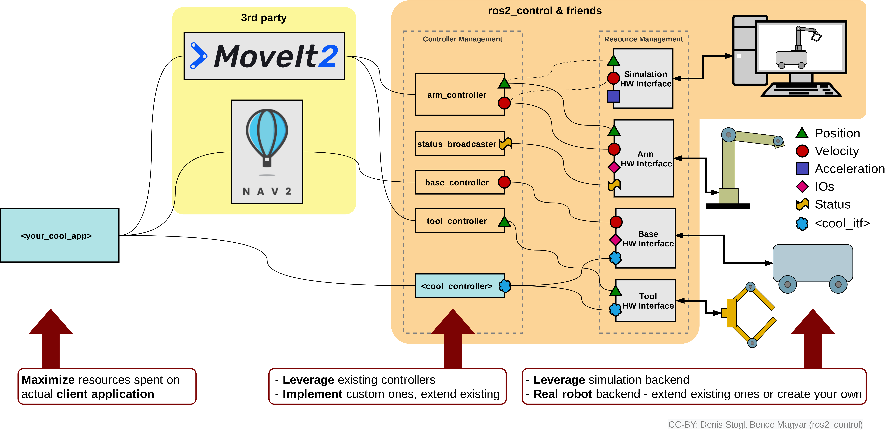

# Los paquetes de ros2_control
Ros2_control es un conjunto de paquetes que incluyen los interfaces de los controladores, los manejadores de los controladores, transmisiones, interfaces hardware y la toolbox de control. Todos estos paquetes conjuntamente permiten interactuar y controlar las articulaciones y actuadores de un robot.

Estos paquetes funcionan de la siguiente manera: los paquetes ros2_control utilizan como entrada los datos relativos acerca del estado de las articulaciones y una entrada de referencia articular. Además, estos paquetes generan como salida el comando adecuado a los actuadores (habitualmente como un comando de esfuerzo, posición o velocidad), con el objetivo de que los valores articulares actuales (joint states) alcancen la referencia articular. Emplean un mecanismo genérico de control mediante realimentación, típicamente un controlador PID, para controlar la salida. Esta acción de control se transfiere al robot a través del interfaz hardware.

En primer lugar, se va a describir cómo integrar los paquetes ros2_control con un entorno de simulación de forma que sea posible controlar el robot simulado empleando esta herramienta. En la siguiente figura se muestra cómo ros2_control puede interactuar bien con el robot simulado o bien con el robot real.



El bloque 3rd party representa la aplicación que envía el objetivo o referencia a los paquetes ros2_control, que puede ser, por ejemplo, el stack Nav2 o la aplicación MoveIt2. En esta figura también se ha representado en naranja el bloque ros2_control, el hardware interfaz en la parte derecha (que representa la conexión entre los diferentes controladores y el robot) y tanto el robot real como el simulado.

## Controladores para manipuladores

Los paquetes ros2_control proporcionan un conjunto de controladores (controller plugins) para interactuar de diferente manera con las articulaciones de un robot. Los controladores disponibles para robots manipuladores son los siguientes:

* Controlador de Admitancia (Admittance Controller)
* Controladores de Esfuerzo (Effort Controllers)
* Controlador de Comando Directo (Forward Command Controller)
* Controlador de Pinza (Gripper Controller)
* Controlador de Trayectoria Articular (Joint Trajectory Controller)
* Controlador de Pinza Paralela (Parallel Gripper Controller)
* Controlador PID (PID Controller)
* Controladores de Posición (Position Controllers)
* Controladores de Velocidad (Velocity Controllers)
* Controlador de Comando GPIO (Gpio Command Controller)

## Broadcasters

Los broadcasters se utilizan para publicar datos de sensores desde componentes de hardware a topics de ROS. En el contexto de ros2_control, los broadcasters siguen siendo controladores y usan la misma interfaz de controlador que los mencionados anteriormente.

Los principales tipos de broadcasters son: 

* Broadcasters de Sensor de Fuerza y Torque (Force Torque Sensor Broadcaster)
* Broadcasters de Sensor IMU (IMU Sensor Broadcaster)
* Broadcasters de Estado Articular (Joint State Broadcaster)
* Broadcasters de Sensor de Rango (Range Sensor Broadcaster)
* Broadcasters de Posición (Pose Broadcaster)

## Parámetros Comunes de los Controladores

Cada controlador o broadcaster tiene algunos parámetros comunes. Estos parámetros deben configurarse antes de su activación. Los parámetros comunes de los controladores son los siguientes:

* update_rate: Parámetro entero sin signo que representa la frecuencia con la que cada controlador/broadcaster ejecuta su ciclo de actualización. Si no se especifica, operan a la misma frecuencia que el controller_manager.
* is_async: Un parámetro booleano que indica si la actualización del controlador debe ejecutarse de forma asíncrona.

En los siguientes apartados se describirán los controladores más comunes.

## forward_command_controller

Esta es una clase base que implementa un controlador de prealimentación o de comando directo (feedforward controller). Implementaciones específicas de esta clase base se pueden encontrar en:

* position_controllers
* velocity_controllers
* effort_controllers

### Tipo de interfaz de hardware

Este controlador se puede utilizar para cualquier tipo de interfaz de hardware.

### Interfaz ROS 2 del controlador

#### Tópics

```
~/commands (topic de entrada) [std_msgs::msg::Float64MultiArray]
    Target joint commands
```

#### Parámetros

Este controlador utiliza la biblioteca generate_parameter_library para gestionar sus parámetros.

#### Ejemplo

Ejemplo de fichero de configuración YAML (será utilizado más adelante):

???+ example
    ```
    controller_manager:
        ros__parameters:
            update_rate: 100  # Hz

            forward_position_controller:
                type: forward_command_controller/ForwardCommandController
            
    forward_position_controller:
        ros__parameters:
            joints:
                - slider_to_cart
    ```
En este código se definen los parámetros para el gestor de controladores (controller_manager). En primer lugar se define la frecuencia de realimentación del controlador a 100 Hz. Además, se define un controlador tipo forward_command_controller/ForwardCommandController el cual se denomina forward_position_controller. Además, se asigna este controlador a la articulación slider_to_cart. Un controlador tipo forward_command_controller/ForwardCommandController simplemente genera como acción de control el valor de su consigna.


## Position_controllers

Se trata de una colección de controladores que funcionan utilizando la interfaz de comando articular de “posición”. Es una especialización del forward_command_controller que funciona utilizando la interfaz articular de “posición”. El paquete contiene los siguientes controladores:

```
position_controllers/JointGroupPositionController
```

### Interfaz ROS 2 del controlador

#### Tópics

```
~/commands (tópico de entrada) [std_msgs::msg::Float64MultiArray] 
    Comandos de posición para las articulaciones
```

#### Parámetros

Este controlador sobrescribe el parámetro de interfaz de forward_command_controller, y el único parámetro obligatorio es joints.

#### Ejemplo

Ejemplo de fichero de configuración yaml.

???+ example
    ```
    controller_manager:
        ros__parameters:
            update_rate: 100  # Hz

            position_controller:
                type: position_controllers/JointGroupPositionController

    position_controller:
        ros__parameters:
            joints:
                - slider_to_cart
    ```

## Velocity_controllers

Se trata de una colección de controladores que funcionan utilizando la interfaz de comando articular de “velocidad”. Es una especialización del forward_command_controller que funciona utilizando la interfaz articular de “velocidad”. El paquete contiene los siguientes controladores:

```
velocity_controllers/JointGroupVelocityController
```

### Interfaz ROS 2 del controlador

#### Tópics

```
~/commands (tópico de entrada) [std_msgs::msg::Float64MultiArray] 
    Comandos de velocidad para las articulaciones
```

#### Parámetros

Este controlador sobrescribe el parámetro de interfaz de forward_command_controller, y el único parámetro obligatorio es joints.

#### Ejemplo

Ejemplo de fichero de configuración yaml.

???+ example
    ```
    controller_manager:
        ros__parameters:
            update_rate: 100  # Hz

            velocity_controller:
                type: velocity_controllers/JointGroupVelocityController

    velocity_controller:
        ros__parameters:
            joints:
                - slider_to_cart
    ```
## Effort_controllers

Se trata de una colección de controladores que funcionan utilizando la interfaz de comando articular de “esfuerzo o par”. Es una especialización del forward_command_controller que funciona utilizando la interfaz articular de “esfuerzo”. El paquete contiene los siguientes controladores:

```
effort_controllers/JointGroupEffortController
```

### Interfaz ROS 2 del controlador

#### Tópics

```
~/commands (tópico de entrada) [std_msgs::msg::Float64MultiArray] 
    Comandos de esfuerzo para las articulaciones
```

#### Parámetros

Este controlador sobrescribe el parámetro de interfaz de forward_command_controller, y el único parámetro obligatorio es joints.

#### Ejemplo

Ejemplo de fichero de configuración yaml.

???+ example
    ```
    controller_manager:
        ros__parameters:
            update_rate: 100  # Hz

            effort_controller:
                type: effort_controllers/JointGroupEffortController

    effort_controller:
        ros__parameters:
            joints:
                - slider_to_cart
    ```

## Controlador PID

Se trata de una implementación de un controlador PID que se basa en el paquete PidROS de [control_toolbox](https://github.com/ros-controls/control_toolbox/). El controlador puede usarse directamente enviando referencias a través de un tópic. También permite utilizar la primera derivada de la referencia y su realimentación para lograr un control PID de segundo orden.

Dependiendo de la interfaz de referencia/estado y la acción de control enviada al hardware, se debe utilizar una configuración de parámetros diferente de PidROS, por ejemplo:

* Referencia/Estado: POSICIÓN; Acción de control: VELOCIDAD → Controlador PI
* Referencia/Estado: VELOCIDAD; Acción de control: ACELERACIÓN → Controlador PI
* Referencia/Estado: VELOCIDAD; Acción de control: POSICIÓN → Controlador PD
* Referencia/Estado: ACELERACIÓN; Acción de control: VELOCIDAD → Controlador PD
* Referencia/Estado: POSICIÓN; Acción de control: POSICIÓN → Controlador PID
* Referencia/Estado: VELOCIDAD; Acción de control: VELOCIDAD → Controlador PID
* Referencia/Estado: ACELERACIÓN; Acción de control: ACELERACIÓN → Controlador PID
* Referencia/Estado: ESFUERZO; Acción de control: ESFUERZO → Controlador PID

Si se utiliza un solo tipo de interfaz de referencia y estado, solo se considera el error inmediato. Si se usan dos tipos, entonces la segunda interfaz se considera la primera derivada de la primera. Por ejemplo, una combinación válida sería las interfaces de posición y velocidad.

Pluginlib-Library: pid_controller Plugin name: pid_controller/PidController

### Interfaz ROS 2 del controlador

#### Topics
```
<dof_names[i]>/<command_interface> [double]
```

#### Parámetros

##### dof_names (string_array)

Especifica dof_names o ejes utilizados por el controlador. Si se define el estado "reference_and_state_dof_names", entonces con este parámetro solo se define lo nombres de los grados de libertad controlados.

Read only: True

Default: {}

##### reference_and_state_dof_names (string_array) (opcional)
Especifica los dof_names o ejes para obtener la referencia y leer los estados. Este parámetro solo es relevante cuando los dof_names de estado son diferentes de los dof_names de comando, es decir, cuando se utiliza un controlador posterior.

Read only: True

Default: {}

##### command_interface (string)
Nombre de la interfaz utilizada por el controlador para enviar comandos al hardware.

Read only: True

Default: “”

##### reference_and_state_interfaces (string_array)
Nombre de las interfaces utilizadas por el controlador para obtener los estados del hardware y los comandos de referencia. La segunda interfaz debe ser la derivada de la primera.

Read only: True

Default: {}

La longitud es mayor que 0 y menor que 3.

##### use_external_measured_states (bool)
Usa estados externos desde un topic en lugar de las interfaces de estado.

Default: false

##### gains.<dof_names>.p (double)
Ganancia proporcional del PID

Default: 0.0

##### gains.<dof_names>.i (double)
Ganancia integral del PID

Default: 0.0

##### gains.<dof_names>.d (double)
Ganancia derivativa del PID

Default: 0.0

##### gains.<dof_names>.antiwindup (bool)
Funcionalidad anti-windup. Cuando está activada (true), limita el error integral para evitar el windup; de lo contrario, restringe la contribución integral en la salida de control. Los valores i_clamp_max e i_clamp_min se aplican en ambos casos.

Default: false

##### gains.<dof_names>.i_clamp_max (double)
Límite superior de la parte integral.

Default: 0.0

##### gains.<dof_names>.i_clamp_min (double)
Límite inferior de la parte integral.

Default: 0.0

##### gains.<dof_names>.feedforward_gain (double)
Ganancia para la parte feed-forward.

Default: 0.0

##### gains.<dof_names>.angle_wraparound (bool)
Para articulaciones que giran completamente (es decir, son continuas). Normaliza el error de posición al rango de -π a π

Default: false

##### gains.<dof_names>.save_i_term (bool)

Indica si el término integral se mantiene después de la reactivación

Default: true

#### Ejemplo

Ejemplo de fichero de configuración yaml.

???+ example
    ```
    test_pid_controller:
        ros__parameters:
            dof_names:
            - joint1

            command_interface: position

            reference_and_state_interfaces: ["position"]

            gains:
                joint1: {p: 1.0, i: 2.0, d: 3.0, i_clamp_max: 5.0, i_clamp_min: -5.0}

    test_pid_controller_angle_wraparound_on:
        ros__parameters:
            dof_names:
            - joint1

            command_interface: position

            reference_and_state_interfaces: ["position"]

            gains:
                joint1: {p: 1.0, i: 2.0, d: 3.0, i_clamp_max: 5.0, i_clamp_min: -5.0, angle_wraparound: true}

    test_pid_controller_with_feedforward_gain:
        ros__parameters:
            dof_names:
            - joint1

            command_interface: position

            reference_and_state_interfaces: ["position"]

            gains:
                joint1: {p: 0.5, i: 0.0, d: 0.0, i_clamp_max: 5.0, i_clamp_min: -5.0, feedforward_gain: 1.0}

    test_pid_controller_with_feedforward_gain_dual_interface:
        ros__parameters:
            dof_names:
            - joint1
            - joint2

            command_interface: velocity

            reference_and_state_interfaces: ["position", "velocity"]

            gains:
                joint1: {p: 0.5, i: 0.3, d: 0.4, i_clamp_max: 5.0, i_clamp_min: -5.0, feedforward_gain: 1.0}
                joint2: {p: 0.5, i: 0.3, d: 0.4, i_clamp_max: 5.0, i_clamp_min: -5.0, feedforward_gain: 1.0}

    test_save_i_term_off:
        ros__parameters:
            dof_names:
            - joint1

            command_interface: position

            reference_and_state_interfaces: ["position"]

            gains:
                joint1: {p: 1.0, i: 2.0, d: 3.0, i_clamp_max: 5.0, i_clamp_min: -5.0, save_i_term: false}

    test_save_i_term_on:
        ros__parameters:
            dof_names:
            - joint1

            command_interface: position

            reference_and_state_interfaces: ["position"]

            gains:
                joint1: {p: 1.0, i: 2.0, d: 3.0, i_clamp_max: 5.0, i_clamp_min: -5.0, save_i_term: true}
    ```